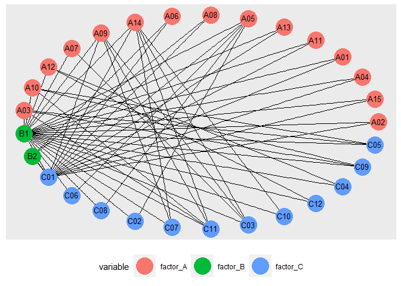

<!-- README.md is generated from README.Rmd. Please edit that file -->

# kclique

<!-- badges: start -->
<!-- badges: end -->

The goal of kclique is to enumerate all maximal kcliques within a
k-partite graph.

## Installation

You can install the development version of kclique from
[GitHub](https://github.com/) with:

``` r
# install.packages("devtools")
devtools::install_github("RemiMahmoud/kclique")
```

## Example

This is a basic example which shows you how to solve a common problem:

``` r
library(kclique)

# Other packages needed
library(dplyr, warn.conflicts = FALSE)
library(igraph, warn.conflicts = FALSE)
library(tidygraph, warn.conflicts = FALSE)
## basic example code
```

### Load toy data

``` r
data("data_example", package ="kclique")

knitr::kable(head(data_example))
```

| factor\_A | factor\_B | factor\_C |
|:----------|:----------|:----------|
| A02       | B1        | C01       |
| A15       | B1        | C01       |
| A04       | B1        | C01       |
| A01       | B1        | C01       |
| A11       | B1        | C01       |
| A13       | B1        | C01       |

As an example, imagine a set of three factors, with various modalities
and combinations of modalities. You can represent the co-occurence of
the modalities by a graph.

### Set graph

``` r
# get graph from the data
graph_example <- get_graph_from_dat(data_example)
```

### Plot data

We can plot the graph, using one color for each factor

``` r
plot_graph_example <- plot_graph(G = graph_example, dat = data_example)
plot_graph_example
```



### List maximal kcliques

If we want to look for all the maximal complete factorial design, we
need to enumerate all the maximal kcliques present in the graph.

``` r
kcliques_example <- kclique::maximal_kclique_enumeration(graph_example, data_example)

knitr::kable(kcliques_example,col.names = "List of kcliques")
```

| List of kcliques                           |
|:-------------------------------------------|
| B1;C01;C03;C11;C07;C10;A14                 |
| B1;C01;C03;C11;C07;A09;A14                 |
| B1;C01;A05;C06;C02;C08                     |
| B1;C01;A02;A09;A14;A05;A13;A11;A01;A04;A15 |
| B1;A10;A03;C11;C05;C09                     |
| B1;A10;A03;C11;A14;A09                     |
| B1;A12;C12;C04                             |
| B1;A07;A09;A14;C03                         |
| A08;A06;B2;C01                             |

### Format kclique in a nice output format

``` r
tibble_kclique <- function_list_kcliques_to_tibble(kcliques_example, data_example)

knitr::kable(tibble_kclique)
```

| factor\_A                           | factor\_B | factor\_C           |
|:------------------------------------|:----------|:--------------------|
| A14                                 | B1        | C11-C10-C07-C03-C01 |
| A14-A09                             | B1        | C11-C07-C03-C01     |
| A05                                 | B1        | C08-C06-C02-C01     |
| A15-A14-A13-A11-A09-A05-A04-A02-A01 | B1        | C01                 |
| A10-A03                             | B1        | C11-C09-C05         |
| A14-A10-A09-A03                     | B1        | C11                 |
| A12                                 | B1        | C12-C04             |
| A14-A09-A07                         | B1        | C03                 |
| A08-A06                             | B2        | C01                 |

We identified 9 maximal kcliques, involving various combinations of
factors’ modalities.

<!-- You'll still need to render `README.Rmd` regularly, to keep `README.md` up-to-date. `devtools::build_readme()` is handy for this. You could also use GitHub Actions to re-render `README.Rmd` every time you push. An example workflow can be found here: <https://github.com/r-lib/actions/tree/v1/examples>. -->
<!-- You can also embed plots, for example: -->
<!-- In that case, don't forget to commit and push the resulting figure files, so they display on GitHub and CRAN. -->
